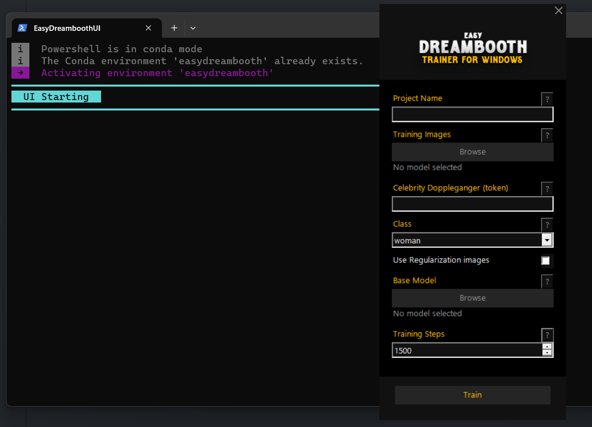

# Index

- [Index](#index)
  - [  Introduction](#--introduction)
    - [**⚠️ WARNING**](#️-warning)
- [ Setup](#-setup)
- [ Setting things up in the UI](#-setting-things-up-in-the-ui)
  - [ Project Name](#-project-name)
  - [ The training images](#-the-training-images)
  - [ Celebrity doppleganger](#-celebrity-doppleganger)
  - [ Class](#-class)
  - [ Base Model](#-base-model)
  - [ Training Steps](#-training-steps)
  - [ Train \& Use](#-train--use)

##   Introduction
This is repo is based off [Joe Penna's Dreambooth Repo](https://github.com/JoePenna/Dreambooth-Stable-Diffusion)

I originally created this fork to simplify local dreambooth face training on windows for GPUs with more than 24GB of VRAM. **I found that using the countless optimized versions of dreambooth and lora never matched the quality of result you get with the original implementation, by far** and I was tired of the cloud GPU hassle

### **⚠️ WARNING**

- This repo probably won't be mainted much, it's a spare time side project
- This is only for training face portraits of humans, altho you might be able to fiddle around and train other things
- AFAIK You can **only run this on a GPU with 24GB of VRAM or more**(e.g. 3090) on **Windows 10 or 11 x64**. Making sure this is the *only* program running can greatly help the speed and stability.
- It works best with variants of Stability's Stable Diffusion 1.5 model
- This implementation does not fully implement Google's ideas on how to preserve the latent space:
  - Most images that are similar to what you're training will be shifted towards that.
  - e.g. If you're training a person, all people will look like you. If you're training an object, anything in that class will look like your object.
- The provided program has a pruner that crunches the final model down to `~2gb`, this does not affect quality
- Follow the instructions bellow carefully

#  Setup
1. Download and install [miniconda](https://repo.anaconda.com/miniconda/Miniconda3-latest-Windows-x86_64.exe), during the install don't forger to add conda to PATH
2. Download [GIT](https://github.com/git-for-windows/git/releases/download/v2.40.0.windows.1/Git-2.40.0-64-bit.exe) and don't forget to add it to PATH during the install as well
3. Open windows explorer and navigate to where you want to install this UI
4. Click in the explorer address bar from within this folder, delete the existing path and type ***powershell*** and press `Enter`
5. In the Powershell terminal, type `git clone https://github.com/Mozoloa/Easy-Dreambooth-Windows`, 
6. Open the newly created folder named ***Easy-Dreambooth-Windows***
7. Right click ***createShortcut.ps1*** and select **"Run with PowerShell"** to create the ***EasyDreamboothUI*** shortcut
8. (optional) After the shortcut is created right-click it, and select **"Pin to taskbar"**
9. Launch the program (optionaly from your taskbar !)
10. This will launch a powershell window before the UI, Wait for it to install all that's needed, this can take a while

#  Setting things up in the UI
⚠️ ***During all the steps bellow, do not use folders with weird special characters in their path, this will break things and I don't plan on actively fixing potential weird paths***

##  Project Name
Name your project, this will be on the trained checkpoint model name in the end, but it does not affect training

##  The training images
Browse to the folder with the images of your subject. **Follow the instructions bellow to create said folder:**

   1. Create a folder somewhere
   2. Find 8 to 20 pictures of your subject
   3. All pictures need to be cropped to 512x512 pixels
   4. All pictures need to be saved as .png files
   5. The picture folder must only contain said pictures
   6. You can't use an odd number of pictures, **it must be even**
   7. Focus on having a diverse set of pictures, where all that stays in between them is what fundamentaly constitutes your subject:
      1. Backgrounds must not repeat between pics
      2. Clothes must not repeat between pics
      3. Use as much lighting variation as possible
      4. Use high quality pictures, avoid overly grainy and blurry pics
      5. Facial expressions must not be too wild, but variety is welcome
      6. Avoid wide angle distorted pics like close selfies
      7. I wouldn't bother with full body shots unless it's very important, focus on portraits and close ups
      8. Avoid major occlusions like hands and remove any other person from the pictures

##  Celebrity doppleganger
[Find your celebrity doppleganger by uploading some of your subject pics to this website](https://starbyface.com/)
   1. This actually helps as celebrities literally are in the "cool" zone of the latent space
   2. **Your celebrity doppleganger must exist in the model you'll use for the training**, try prompting their name in your prefered stable diffusion generation program with the model selected, if they're faithfully generated then you're good, else find another one, it's okay if they only vaguely resemble you as long as there's a little something, and the model you'll use to resume training can generate them faithfully.
   3. Enter their name in the "**Celebrity Doppleganger (token)**" field

##  Class
What gender is your subject ? This will help compare with the existing representation in the model by downloading a set of pre generated pictures of that class (woman, man or person) so everybody in the model doesn't end up looking like your subject (honestly, they will anyway lmao)

##  Base Model
Browse to the model you'll use as a base for training, we recommend using [Stable Diffusion V1.5 with the New VAE](https://anga.tv/ems/model.ckpt) as this works best.

##  Training Steps
How many steps will the training take, obviously it will take more time if you increase the step count. It is recommended to go with 100 x your number of pics minimum, or just try with 1500 or 2000 and see how that goes (I always go with 1500 for 8 to 14 pics and it works very well)

##  Train & Use
Once everything is set, click train and the rest should happen in the powershell console.
If all goes well, the training will finish, the trained model will be pruned (to be of lower size) and once all is done, it should open the "trained_models" with your newly trained .ckpt model in it ! 

You can then move it wherever you want and use it in any of your desired Stable Diffusion Software/UI by using this formula in your prompt:
`Token(no caps no space)` + `Class`

For example : if you've chosen **Barrack Obama** as your celeb doppleganger before training, and selected `man` as the **class**, then you should prompt like this : `a barrackobama man chilling on the beach, professional photography, 4K, whatever, whatever`

